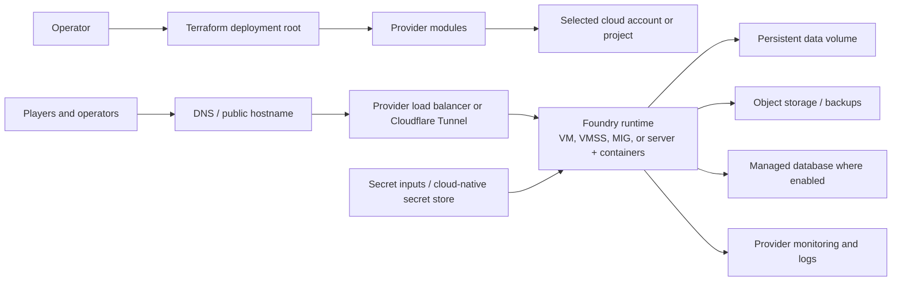

# LegendForge Architecture

This document is the repository-level architecture reference for LegendForge,
the Terraform platform used to host Foundry VTT across AWS, Azure, GCP, and
Hetzner.

It describes the composition of the active Terraform deployment roots. The
provider deployment READMEs, Terraform configuration, and generated plan are
the source of truth for exact resource behavior and environment-specific
choices. Older summary documents may describe proposed or historical designs.

## Purpose and scope

LegendForge provisions the hosting layer around Foundry VTT. The infrastructure
is intentionally system-agnostic: game systems, modules, and campaign content
are installed and managed at the Foundry layer after the hosting environment
is available.

The architecture is organized around four independent deployment roots rather
than one cross-cloud Terraform stack. An environment selects a provider root;
the selected root owns its own state and creates a complete deployment for
that provider.

## Architectural principles

- **Provider isolation:** Each provider has its own Terraform root, modules,
  variables, outputs, and lifecycle. Provider deployments do not share
  Terraform state.
- **Module boundaries:** Deployment roots compose reusable provider modules.
  The shared `foundry-app` module contains common host bootstrap behavior,
  while provider modules encapsulate cloud primitives and integrations.
- **System agnosticism:** Foundry hosts the application and its systems. The
  cloud layer supplies compute, networking, persistence, secrets, and
  operational controls without coupling the infrastructure to a particular
  tabletop ruleset.
- **Controlled ingress:** Public access is routed through the ingress model
  selected by the provider deployment. Cloudflare Tunnel is used where the
  active configuration enables it; provider load balancers are used where the
  deployment exposes one directly.
- **Persistent campaign data:** Foundry data is kept on persistent storage,
  with provider-specific database, object-storage, and backup capabilities.
  Recovery procedures must be verified for the selected provider rather than
  assumed to be identical across clouds.
- **Least privilege and secret isolation:** Network rules, IAM/RBAC, private
  service paths, and cloud-native secret stores are preferred. Secrets,
  Terraform state, plans, and variable files are not source-controlled.
- **Reproducible changes:** Provider lock files are committed, plans are
  reviewed before apply, and the repository quality checks are run for every
  provider affected by a change.

## System context

The following diagram shows the common control and runtime relationships. A
provider deployment realizes only the components and paths supported by its
active configuration.



At runtime, the typical sequence is:

1. Terraform creates the selected provider's network, identity, data,
   compute, ingress, and monitoring resources.
2. Host bootstrap installs the runtime dependencies, mounts persistent data,
   retrieves or receives required secrets, and starts Foundry and any ingress
   connector.
3. Users reach Foundry through the configured hostname and ingress path.
4. Campaign data is written to persistent disk and, where configured, to
   managed databases or object storage used for backups and supporting data.
5. Provider monitoring, logs, and recovery mechanisms support operations.

## Repository topology

```text
infrastructure/
├── deployments/
│   ├── aws/       # AWS Terraform root
│   ├── azure/     # Azure Terraform root
│   ├── gcp/       # GCP Terraform root
│   └── hetzner/   # Hetzner Terraform root
└── modules/
    ├── foundry-app/             # Shared host bootstrap and container setup
    ├── aws-*/                   # AWS networking and managed-service modules
    ├── azure/                   # Azure networking, security, data, and compute
    ├── gcp-*/                   # GCP networking, identity, data, and runtime
    └── providers/hetzner/       # Hetzner-specific composition

scripts/                         # Validation and operational helpers
tests/                           # Acceptance and repository tests
wiki/                            # Longer-form architecture and security notes
```

The deployment roots are the composition boundary. They assemble modules,
provide environment values, and expose outputs; modules implement the cloud
resources and host configuration.

## Provider topologies

| Provider | Terraform root | Active composition | Ingress and recovery characteristics |
| --- | --- | --- | --- |
| AWS | [`infrastructure/deployments/aws`](infrastructure/deployments/aws) | VPC, security groups, RDS, S3, IAM, ALB, CloudFront, ASG/EC2, CloudWatch, Route 53, and ACM | The root composes load-balancing and edge services with private application/data components. The EC2 bootstrap supports the Foundry and Cloudflare Tunnel containers. RDS, S3, and persistent host data provide separate recovery surfaces. |
| Azure | [`infrastructure/deployments/azure`](infrastructure/deployments/azure) | VNet and subnets, NSGs, NAT, DDoS protection, storage, Key Vault, managed database, VM scale set, public Load Balancer, and optional monitoring | The current deployment exposes a public Load Balancer and returns an HTTP endpoint. TLS termination, hostname, and any tunnel path must be verified against the selected Azure module and plan before being treated as enabled. |
| GCP | [`infrastructure/deployments/gcp`](infrastructure/deployments/gcp) | VPC, IAM, Secret Manager, Cloud SQL, Cloud Storage, compute, load balancer, and optional monitoring/CDN/Cloud Armor | The startup configuration retrieves secrets, starts Foundry and Cloudflare Tunnel, mounts persistent data, and includes a Cloud Storage backup path. Firewall rules distinguish internal, health-check, load-balancer, and administrative traffic. |
| Hetzner | [`infrastructure/deployments/hetzner`](infrastructure/deployments/hetzner) | Network, subnet, firewall, server, attached volume, server networking, and the shared `foundry-app` module | The intended application path is an outbound Cloudflare Tunnel with no general inbound application exposure. The attached volume is persistent, but off-server archiving is a separate operational responsibility; use the Hetzner archive helper and deployment guidance. |

These topologies are alternatives, not layers that are automatically deployed
together. Choose one root for an environment unless a deliberate multi-cloud
architecture has been designed and separately operated.

## Application and data boundaries

### Foundry runtime

Foundry runs in containers on provider-managed virtual machines or a scale-set,
instance-group, or server abstraction. Bootstrap templates install Docker and
configure the Foundry container, persistent data path, and—where enabled—the
Cloudflare Tunnel sidecar. Image tags and runtime inputs vary by provider, so
they must be reviewed in the selected deployment root rather than inferred
from another cloud.

### Persistent data

Foundry campaign artifacts require storage that survives instance replacement.
The implementation differs by provider:

- AWS combines persistent host storage with S3 and a managed relational
  database in the deployment composition.
- Azure combines VM/managed storage with private Blob Storage and a managed
  database; the exact backup and retention behavior is configured per
  environment.
- GCP combines a persistent data disk with Cloud Storage, Cloud SQL, and the
  configured backup workflow.
- Hetzner uses an attached persistent volume. The module does not make an
  off-server archive automatically equivalent to a backup policy; archive and
  restore must be run and verified separately.

Object storage is not assumed to be a live replacement for Foundry's data
directory. It is used for the provider-specific supporting data and backup
paths defined by each deployment.

### Secrets and identity

Typical sensitive inputs include the Foundry license and administrator values,
database credentials, and a Cloudflare Tunnel token. They are supplied through
ignored variable files, environment mechanisms, or cloud-native secret stores
as appropriate for the provider. Terraform `sensitive` markings reduce output
exposure but do not remove values from state; state storage and access controls
therefore remain security boundaries.

## Network and security boundaries

- The application ingress path is provider-specific. AWS, GCP, and Hetzner
  configurations include Cloudflare Tunnel support in their host bootstrap;
  AWS and GCP also compose provider load-balancing resources. Azure's current
  deployment path is a public Load Balancer and should not be documented as
  tunnel-only without a corresponding active configuration.
- Databases and storage services are intended to be reachable only through
  the application or private service paths required by the provider design.
- Administrative access is a break-glass capability and should be narrowed to
  approved source ranges or replaced with the provider's managed access path.
- Firewall, security-group, NSG, IAM/RBAC, private-endpoint, and secret-store
  controls are implemented in provider modules. A change to a module can
  affect every deployment root that consumes it.
- Terraform state, plans, `*.tfvars`, and environment secrets can contain
  sensitive values. Keep them out of Git and protect any remote backend with
  encryption, access control, and locking.
- Provider plugins are constrained by Terraform configuration and the
  committed `.terraform.lock.hcl` files. Lock-file changes should be reviewed
  as dependency changes.

## State and lifecycle

Each deployment root owns independent Terraform state. The repository ignores
local state, plans, and sensitive variable files; production or shared use
should configure an encrypted remote backend with locking for the selected
provider. The AWS root contains an optional backend example, but no backend
configuration should be assumed to be active for every environment.

Normal lifecycle controls are:

1. Review provider variables and the current deployment guide.
2. Run formatting, initialization without a backend, validation, and linting.
3. Inspect `terraform plan` for network, data, access, and replacement changes.
4. Apply only after confirming the target account/project, state backend, and
   recovery posture.
5. Before destroying or replacing compute or storage, verify a restorable
   backup. In particular, provider flags that disable compute may also destroy
   attached storage depending on the module implementation.

## Validation and operational gates

For a documentation-only change, the local Markdown diff should still pass
`git diff --check`. For Terraform changes, the repository's standard quality
entry point is:

```bash
TERRAFORM_QUALITY_TARGETS=aws,azure,gcp,hetzner scripts/terraform-quality.sh
```

The script checks formatting, initializes each selected deployment without a
backend, validates Terraform, and runs TFLint. The default target is AWS, so
the four-provider target list is required when a change may affect shared or
provider-specific infrastructure beyond AWS. Pre-commit and CI also run the
repository's security and acceptance checks.

## Related documentation

- [`README.md`](README.md) — project overview and deployment entry points
- [`DOCUMENTATION_INDEX.md`](DOCUMENTATION_INDEX.md) — documentation map
- [`PROJECT_PHILOSOPHY.md`](PROJECT_PHILOSOPHY.md) — design principles
- [`wiki/Architecture-and-Security.md`](wiki/Architecture-and-Security.md) — shared security themes
- [`infrastructure/deployments/aws/ARCHITECTURE.md`](infrastructure/deployments/aws/ARCHITECTURE.md) — AWS details
- [`infrastructure/deployments/gcp/ARCHITECTURE.md`](infrastructure/deployments/gcp/ARCHITECTURE.md) — GCP details
- [`infrastructure/deployments/azure/README.md`](infrastructure/deployments/azure/README.md) — current Azure deployment guide
- [`infrastructure/deployments/hetzner/README.md`](infrastructure/deployments/hetzner/README.md) — current Hetzner deployment guide
- [`scripts/terraform-quality.sh`](scripts/terraform-quality.sh) — Terraform quality gate
- [`scripts/hetzner-data-archive.sh`](scripts/hetzner-data-archive.sh) — Hetzner archive and restore helper
