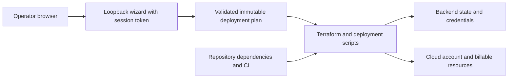

# LegendForge-CloudCampaigns detailed threat-model baseline

## Status and scope

Source baseline: `537d27c8c5d1152d070087fc7ea8b961a166d1a4`. Adoption: 2026-10-08.
Status: source-based initial model; independent human security review pending.
This model contains attack hypotheses, not validated vulnerability findings.
Existing canonical security documentation and stricter acceptance gates remain
applicable. Future changes must update this baseline rather than treating its
source revision as evidence for newer behavior.

Python planning/CLI and local credential wizard plus Terraform recipes for AWS, Azure, GCP and Hetzner. Recipes and local checks are not evidence of deployed isolation or permission correctness. Cloud apply, paid resources and live security validation need separately authorized execution.

## Assets, actors and assumptions

Assets: Cloud credentials and keyring references; Terraform plans/state/user-data; resource/account identities; deployment budget; wizard session token; generated infrastructure and operator machine.

Actors: Local operator; hostile browser page; local process; malicious configuration author; compromised provider/dependency/image; cloud principal with excessive permissions.

Assume an authorized operator, a trusted host and reviewed checkout. Treat input,
remote responses and imported content as untrusted. Repository access or a local
host administrator can bypass controls inside that same authority domain. Live
IAM, network controls, secret backend behavior and release protection require
operating evidence; they are not inferred from configuration files. Credentials,
private payloads and real identifiers must never be copied into this document.

## Components, data flows and trust boundaries

| Flow | Boundary and effective authority |
| --- | --- |
| Browser → loopback wizard → credential store | Session bearer token, Host and Origin guards protect a privileged local service; local processes remain a different threat. |
| CLI → plan/config → Terraform provider → cloud account | Untrusted values and provider execution can gain resource creation and billing authority. |
| Credential reference → OS backend → provider invocation | Only intended recipients should receive credential material; repr redaction does not remove memory or state exposure. |

The flow table defines the project-specific boundaries behind this overview.
Authentication of an upstream service does not make its content trusted. Review
the effective filesystem path, subprocess arguments, network recipient, cloud
account and credential recipient rather than only their user-supplied labels.

## Implementation evidence inventory

- `src/legendforge/wizard.py`: inspect at the baseline revision; evidence scope is limited to this component.
- `src/legendforge/credentials.py`: inspect at the baseline revision; evidence scope is limited to this component.
- `infrastructure/deployments`: inspect at the baseline revision; evidence scope is limited to this component.
- `AGENTS.md`: inspect at the baseline revision; evidence scope is limited to this component.

## Threat register and prioritization

Impact High means private-data/credential exposure, authority escalation, material
integrity loss or substantial operational harm. Medium means bounded disclosure,
misleading results or recoverable disruption. Likelihood Medium means an exposed
or routinely supplied input could reach the boundary; Low needs stronger local
access or multiple prerequisites. P1 requires review/remediation or explicit human
risk acceptance before the affected capability is released; P2 requires scheduled
hardening and validation before expanding exposure. These are qualitative planning
priorities, not CVSS scores or proof of exploitability.

For every entry below, the human accountable owner is **maintainer/security
reviewer, assignment pending**. Triage within 30 days of adoption; complete P1
validation before the affected release/capability expansion and schedule P2 within
90 days. Existing controls do not close the hypothesis without validation.

### T01: Wizard cross-origin abuse

- Attack path / prerequisite: A malicious website submits credentials or triggers privileged local operations.
- Inherent impact: High; likelihood: Medium; priority: P1.
- Existing evidence / limitation: wizard.py binds loopback ephemeral port, checks Host/Origin and compares random session bearer tokens.
- Proposed mitigation and validation: Test missing/mismatched token, Origin and Host, DNS rebinding and unsupported methods; do not equate loopback with authentication.
- Residual risk / status: unverified; human review and evidence pending. Retain
  this entry until a reviewer records outcome, exact revision and remaining risk.

### T02: Secret backend downgrade

- Attack path / prerequisite: Missing secure backend silently falls back to plaintext credential storage.
- Inherent impact: High; likelihood: Medium; priority: P1.
- Existing evidence / limitation: credentials.py allowlists supported keyring backends and uses redacted/nonpickleable Secret values.
- Proposed mitigation and validation: Test unavailable or unexpected backend failures; confirm no plaintext fallback and no credential-bearing exception output.
- Residual risk / status: unverified; human review and evidence pending. Retain
  this entry until a reviewer records outcome, exact revision and remaining risk.

### T03: Plan/state disclosure

- Attack path / prerequisite: Terraform state, plans or user-data expose secrets through Git, logs or artifacts.
- Inherent impact: High; likelihood: Medium; priority: P1.
- Existing evidence / limitation: Credential references reduce direct handling; Terraform files remain sensitive operational assets.
- Proposed mitigation and validation: Inventory each provider state/backend and secret sink; require encryption, restricted access and retention before live use.
- Residual risk / status: unverified; human review and evidence pending. Retain
  this entry until a reviewer records outcome, exact revision and remaining risk.

### T04: Excessive cloud authority

- Attack path / prerequisite: A plan targets the wrong account/project or creates broad network access.
- Inherent impact: High; likelihood: Medium; priority: P1.
- Existing evidence / limitation: Recipes exist for multiple providers; actual IAM/firewall effectiveness is unverified.
- Proposed mitigation and validation: Review exact account/project, least-privilege role and inbound rules in the plan; test policy and deployment separately.
- Residual risk / status: unverified; human review and evidence pending. Retain
  this entry until a reviewer records outcome, exact revision and remaining risk.

### T05: Cost/availability abuse

- Attack path / prerequisite: Repeated applies or expensive defaults create budget loss or outage.
- Inherent impact: High; likelihood: Medium; priority: P1.
- Existing evidence / limitation: Planning is distinct from authorization to apply.
- Proposed mitigation and validation: Require explicit cost/account approval, budget alerts and verified teardown; record deletion dependencies and backups.
- Residual risk / status: unverified; human review and evidence pending. Retain
  this entry until a reviewer records outcome, exact revision and remaining risk.

### T06: Acknowledgment drift

- Attack path / prerequisite: Operator approves one plan but later config/session executes another.
- Inherent impact: High; likelihood: Low; priority: P2.
- Existing evidence / limitation: wizard.py contains immutable acknowledgment handling.
- Proposed mitigation and validation: Test mutation after acknowledgment and replay; bind execution evidence to exact plan/config digest and human decision.
- Residual risk / status: unverified; human review and evidence pending. Retain
  this entry until a reviewer records outcome, exact revision and remaining risk.

### T07: Build or dependency compromise

- Attack path / prerequisite: A compromised dependency, image or workflow obtains developer or release authority.
- Inherent impact: High; likelihood: Medium; priority: P1.
- Existing evidence / limitation: Repository validation is evidence of local checks, not proof of dependency provenance or hosted policy.
- Proposed mitigation and validation: Inventory and pin applicable dependencies/actions/images; review changes, scan known issues and verify exact release artifact provenance.
- Residual risk / status: unverified; human review and evidence pending. Retain
  this entry until a reviewer records outcome, exact revision and remaining risk.

### T08: Incident recovery failure

- Attack path / prerequisite: Credentials, data or service availability cannot be recovered after compromise or accidental change.
- Inherent impact: High; likelihood: Low; priority: P2.
- Existing evidence / limitation: Operational checkpoints preserve code history; data and credential recovery require separate procedures.
- Proposed mitigation and validation: Human owner must document detection signals, restricted incident evidence, credential revocation, backups and a disposable restore exercise.
- Residual risk / status: unverified; human review and evidence pending. Retain
  this entry until a reviewer records outcome, exact revision and remaining risk.

## STRIDE and privacy coverage

| Category | Review obligation |
| --- | --- |
| Spoofing | Verify user/service/endpoint identity and binding to effective resource; reject stale/replayed authorization. |
| Tampering | Protect source, state, imported records and generated artifacts; test races and malformed input. |
| Repudiation | Record bounded, redacted action and review evidence with revision and actor; protect audit access. |
| Information disclosure | Trace secrets/private data through storage, logs, exports, backups and external recipients. |
| Denial of service | Bound input size, concurrency, retries and time; test dependency failure and recovery. |
| Elevation of privilege | Inventory tool/subprocess, filesystem, cloud and release privileges; deny unauthorized capability expansion. |
| Privacy | Confirm purpose, consent, minimization, retention/deletion and provider handling before real private data use. |

These obligations apply to each flow above. A component without a given surface
must record why the control is inapplicable; absence of evidence is not a pass.

## Security operations and open questions

Before real deployment or expanded capability, assign named human owners and
confirm effective identity/IAM, endpoint and network exposure, secret storage and
rotation, private-data lifecycle, dependency provenance, release authority and
resource limits. Record deployment/version-specific evidence and unresolved gaps.
Define redacted detection signals for rejected authorization, unexpected endpoint
changes, repeated parse failures and resource exhaustion where applicable. Keep
incident evidence access restricted. Document credential revocation, containment,
recovery owner, backups and restore validation; do not execute live destructive
or paid operations without their existing authorization.

Validate threats with synthetic negative tests and bounded local fixtures first;
use authorized integration/live checks only where needed and identify their
actual operating scope. A passing static/local test does not establish hosted,
packaged, cloud or physical-device assurance. Security findings discovered during
validation need reproducible evidence and separate tracked remediation.

## Maintenance and human acceptance

Update this model alongside changes to any listed asset, flow, recipient,
permission, parser, dependency, build or deployment assumption. Review at each
release and quarterly; record next review date when a human accepts the baseline.
Use [Engineering review policy](ENGINEERING_REVIEW.md) for reference frameworks,
checkpoint commits and exact-revision approval, and
[Review coverage](security/REVIEW_COVERAGE.md) for the outstanding retroactive
inventory. Human reviewer/date/accepted revision: **pending**. No residual risk is
accepted by this initial document.
